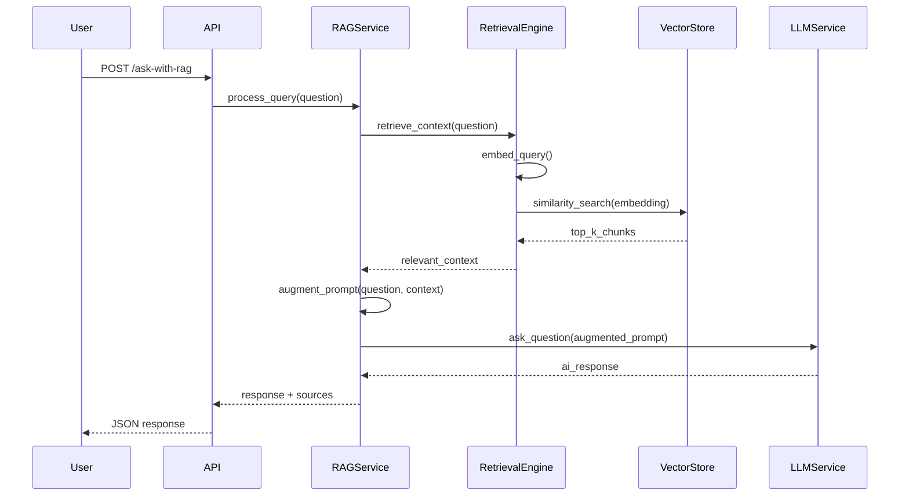

# Design Document: WhatsApp RAG System

## Overview

This design implements a Retrieval-Augmented Generation (RAG) system that enhances the existing Farm AI Assistant with historical context from 3 years of WhatsApp channel conversations. The system follows a classic RAG architecture: parse → chunk → embed → store → retrieve → augment → generate.

The implementation uses Python with established libraries to minimize complexity while maximizing learning opportunities:
- **ChromaDB** for vector storage (lightweight, embedded, persistent)
- **sentence-transformers** for embeddings (pre-trained models optimized for semantic search)
- **FastAPI** integration with existing endpoints
- **Pydantic** for data validation and configuration

The design prioritizes simplicity and educational value, making RAG concepts tangible through hands-on implementation.

## Architecture

### High-Level Architecture

```
┌─────────────────────────────────────────────────────────────────┐
│                        RAG System Pipeline                       │
└─────────────────────────────────────────────────────────────────┘

1. INGESTION PHASE (Offline)
   ┌──────────────┐    ┌──────────────┐    ┌──────────────┐
   │  WhatsApp    │───▶│   Parser     │───▶│   Chunker    │
   │  Export.txt  │    │              │    │              │
   └──────────────┘    └──────────────┘    └──────────────┘
                                                    │
                                                    ▼
   ┌──────────────┐    ┌──────────────┐    ┌──────────────┐
   │  ChromaDB    │◀───│  Embedder    │◀───│  Chunks      │
   │ Vector Store │    │ (sentence-   │    │  (with       │
   │              │    │ transformers)│    │  metadata)   │
   └──────────────┘    └──────────────┘    └──────────────┘

2. QUERY PHASE (Runtime)
   ┌──────────────┐    ┌──────────────┐    ┌──────────────┐
   │ User Query   │───▶│  Retrieval   │───▶│  Top-K       │
   │              │    │  Engine      │    │  Chunks      │
   └──────────────┘    └──────────────┘    └──────────────┘
                                                    │
                                                    ▼
   ┌──────────────┐    ┌──────────────┐    ┌──────────────┐
   │ LLM Response │◀───│ LLM Service  │◀───│  Context     │
   │ (Enhanced)   │    │ (OpenAI)     │    │  Augmenter   │
   └──────────────┘    └──────────────┘    └──────────────┘
```

### Component Interaction Flow



## Components and Interfaces

### 1. WhatsApp Parser (`app/services/whatsapp_parser.py`)

**Purpose:** Extract structured message data from WhatsApp chat export files.

**Interface:**
```python
class WhatsAppParser:
    def parse_chat_file(self, file_path: str) -> List[ChatMessage]:
        """Parse WhatsApp export file into structured messages."""
        pass
    
    def _parse_message_line(self, line: str) -> Optional[ChatMessage]:
        """Parse a single line into a ChatMessage object."""
        pass
    
    def _is_continuation(self, line: str) -> bool:
        """Check if line is a continuation of previous message."""
        pass
```

**Implementation Details:**
- WhatsApp exports follow pattern: `[DD/MM/YYYY, HH:MM:SS] Sender: Message`
- Multi-line messages don't have timestamp prefix on continuation lines
- System messages (e.g., "Messages and calls are end-to-end encrypted") should be filtered
- Media messages show as `<Media omitted>` - store as metadata, not content
- Handle both 12-hour and 24-hour time formats
- Use regex for robust timestamp detection: `r'\[(\d{1,2}/\d{1,2}/\d{4}), (\d{1,2}:\d{2}:\d{2})\]'`

### 2. Document Chunker (`app/services/document_chunker.py`)

**Purpose:** Group messages into semantically meaningful chunks for retrieval.

**Interface:**
```python
class DocumentChunker:
    def __init__(self, min_messages: int = 3, max_messages: int = 20, 
                 time_gap_hours: int = 2):
        """Initialize chunker with configurable parameters."""
        pass
    
    def chunk_messages(self, messages: List[ChatMessage]) -> List[DocumentChunk]:
        """Group messages into chunks based on temporal and semantic boundaries."""
        pass
    
    def _should_start_new_chunk(self, current_chunk: List[ChatMessage], 
                                 next_message: ChatMessage) -> bool:
        """Determine if next message should start a new chunk."""
        pass
```

**Chunking Strategy:**
- Start new chunk when time gap exceeds threshold (default 2 hours)
- Start new chunk when max_messages reached
- Ensure minimum chunk size for context (min 3 messages)
- Preserve conversation flow - don't split mid-conversation
- Include metadata: date range, participants, message count

**Chunk Metadata:**
```python
@dataclass
class DocumentChunk:
    id: str  # UUID
    text: str  # Combined message text
    messages: List[ChatMessage]  # Original messages
    start_date: datetime
    end_date: datetime
    participants: List[str]
    message_count: int
    embedding: Optional[List[float]] = None
```

### 3. Embedding Service (`app/services/embedding_service.py`)

**Purpose:** Generate vector embeddings for text chunks using pre-trained models.

**Interface:**
```python
class EmbeddingService:
    def __init__(self, model_name: str = "all-MiniLM-L6-v2"):
        """Initialize with sentence-transformers model."""
        self.model = SentenceTransformer(model_name)
    
    def embed_text(self, text: str) -> List[float]:
        """Generate embedding for single text."""
        pass
    
    def embed_batch(self, texts: List[str], batch_size: int = 32) -> List[List[float]]:
        """Generate embeddings for multiple texts efficiently."""
        pass
    
    def get_embedding_dimension(self) -> int:
        """Return dimension of embedding vectors."""
        pass
```

**Model Selection:**
- **all-MiniLM-L6-v2**: Fast, 384 dimensions, good for general semantic search (recommended for learning)
- **all-mpnet-base-v2**: Higher quality, 768 dimensions, slower (for production)
- Models from sentence-transformers library are pre-trained on semantic similarity tasks
- No fine-tuning needed for initial implementation

**Performance Considerations:**
- Batch processing for efficiency (32 texts per batch)
- Cache model in memory (singleton pattern)
- Use GPU if available (automatic with sentence-transformers)

### 4. Vector Store (`app/services/vector_store.py`)

**Purpose:** Persist and query vector embeddings using ChromaDB.

**Interface:**
```python
class VectorStore:
    def __init__(self, persist_directory: str = "./data/chroma_db"):
        """Initialize ChromaDB with persistence."""
        self.client = chromadb.PersistentClient(path=persist_directory)
        self.collection = self.client.get_or_create_collection(
            name="whatsapp_history",
            metadata={"hnsw:space": "cosine"}
        )
    
    def add_chunks(self, chunks: List[DocumentChunk]) -> None:
        """Add document chunks with embeddings to store."""
        pass
    
    def query(self, query_embedding: List[float], top_k: int = 5, 
              filters: Optional[Dict] = None) -> List[RetrievalResult]:
        """Query for similar chunks."""
        pass
    
    def count(self) -> int:
        """Return total number of stored chunks."""
        pass
    
    def clear(self) -> None:
        """Clear all data (for re-ingestion)."""
        pass
```

**ChromaDB Configuration:**
- **Distance metric:** Cosine similarity (best for normalized embeddings)
- **Persistence:** Local directory storage for durability
- **Indexing:** HNSW (Hierarchical Navigable Small World) for fast approximate search
- **Metadata storage:** Store chunk metadata alongside embeddings for filtering

**Storage Structure:**
```python
# ChromaDB stores:
{
    "ids": [chunk.id],
    "embeddings": [chunk.embedding],
    "documents": [chunk.text],
    "metadatas": [{
        "start_date": chunk.start_date.isoformat(),
        "end_date": chunk.end_date.isoformat(),
        "participants": ",".join(chunk.participants),
        "message_count": chunk.message_count
    }]
}
```

### 5. Retrieval Engine (`app/services/retrieval_engine.py`)

**Purpose:** Orchestrate query embedding and similarity search.

**Interface:**
```python
class RetrievalEngine:
    def __init__(self, embedding_service: EmbeddingService, 
                 vector_store: VectorStore):
        """Initialize with embedding service and vector store."""
        pass
    
    def retrieve_context(self, query: str, top_k: int = 5, 
                        similarity_threshold: float = 0.3) -> List[RetrievalResult]:
        """Retrieve relevant chunks for query."""
        pass
    
    def _filter_by_threshold(self, results: List[RetrievalResult], 
                            threshold: float) -> List[RetrievalResult]:
        """Filter results below similarity threshold."""
        pass
```

**Retrieval Process:**
1. Embed user query using EmbeddingService
2. Query VectorStore with query embedding
3. Filter results by similarity threshold (default 0.3)
4. Return top-k results with scores and metadata

**Result Format:**
```python
@dataclass
class RetrievalResult:
    chunk_id: str
    text: str
    score: float  # Similarity score (0-1)
    metadata: Dict
    source_info: str  # Formatted source attribution
```

### 6. Context Augmenter (`app/services/context_augmenter.py`)

**Purpose:** Format retrieved context and augment LLM prompts.

**Interface:**
```python
class ContextAugmenter:
    def __init__(self, max_context_tokens: int = 2000):
        """Initialize with token limit."""
        pass
    
    def augment_prompt(self, query: str, 
                      retrieved_chunks: List[RetrievalResult]) -> str:
        """Create augmented prompt with context."""
        pass
    
    def _format_context_section(self, chunks: List[RetrievalResult]) -> str:
        """Format chunks into context section."""
        pass
    
    def _estimate_tokens(self, text: str) -> int:
        """Estimate token count (rough: 1 token ≈ 4 chars)."""
        pass
    
    def _truncate_context(self, chunks: List[RetrievalResult], 
                         max_tokens: int) -> List[RetrievalResult]:
        """Truncate chunks to fit token limit."""
        pass
```

**Prompt Template:**
```
HISTORICAL CONTEXT FROM WHATSAPP:
The following are relevant excerpts from past conversations that may help answer the question.

[Context 1 - {date_range}, participants: {participants}]
{chunk_text}

[Context 2 - {date_range}, participants: {participants}]
{chunk_text}

---

CURRENT QUESTION: {user_query}

Please answer the question using the historical context above when relevant. If the context doesn't help, answer based on your general knowledge.
```

**Token Management:**
- Estimate tokens: ~4 characters per token (rough approximation)
- Prioritize highest-scoring chunks when truncating
- Reserve tokens for user query and system prompt
- Maximum context: 2000 tokens (configurable)

### 7. RAG Service (`app/services/rag_service.py`)

**Purpose:** Orchestrate the complete RAG pipeline for query processing.

**Interface:**
```python
class RAGService:
    def __init__(self, retrieval_engine: RetrievalEngine,
                 context_augmenter: ContextAugmenter,
                 llm_service: FarmLLMService):
        """Initialize RAG service with dependencies."""
        pass
    
    async def ask_with_rag(self, question: str, 
                          farm_data: Optional[Dict] = None,
                          conversation_id: Optional[str] = None,
                          use_rag: bool = True) -> RAGResponse:
        """Process query with RAG enhancement."""
        pass
    
    def _format_sources(self, chunks: List[RetrievalResult]) -> List[Dict]:
        """Format source information for response."""
        pass
```

**Processing Flow:**
1. Retrieve relevant context using RetrievalEngine
2. Augment prompt with context using ContextAugmenter
3. Call existing LLMService with augmented prompt
4. Return response with source attribution
5. Handle fallback to non-RAG mode on errors

**Response Format:**
```python
@dataclass
class RAGResponse:
    answer: str
    confidence: float
    sources: List[Dict]  # Source chunks used
    conversation_id: str
    rag_used: bool  # Whether RAG context was applied
    retrieval_time_ms: float
```

### 8. Ingestion Pipeline (`scripts/ingest_whatsapp.py`)

**Purpose:** Command-line tool to process and index WhatsApp exports.

**Interface:**
```python
class IngestionPipeline:
    def __init__(self, config: IngestionConfig):
        """Initialize pipeline with configuration."""
        pass
    
    def ingest_file(self, file_path: str, clear_existing: bool = False) -> IngestionStats:
        """Process WhatsApp export file and index it."""
        pass
    
    def _show_progress(self, current: int, total: int, stage: str) -> None:
        """Display progress bar."""
        pass
```

**Pipeline Stages:**
1. **Parse:** Extract messages from file
2. **Chunk:** Group messages into chunks
3. **Embed:** Generate embeddings for chunks
4. **Store:** Persist to ChromaDB
5. **Report:** Display statistics

**Progress Display:**
```
Ingesting WhatsApp chat history...
[1/4] Parsing messages... ████████████████████ 100% (15,234 messages)
[2/4] Chunking messages... ████████████████████ 100% (1,523 chunks)
[3/4] Generating embeddings... ████████████████████ 100% (1,523 chunks)
[4/4] Storing in vector DB... ████████████████████ 100% (1,523 chunks)

✓ Ingestion complete!
  Total messages: 15,234
  Total chunks: 1,523
  Processing time: 3m 42s
  Average chunk size: 10 messages
```

## Data Models

### Core Data Models

```python
from dataclasses import dataclass
from datetime import datetime
from typing import List, Optional, Dict
from enum import Enum

class MessageType(Enum):
    TEXT = "text"
    MEDIA = "media"
    SYSTEM = "system"

@dataclass
class ChatMessage:
    """Single WhatsApp message."""
    timestamp: datetime
    sender: str
    content: str
    message_type: MessageType
    raw_line: str  # Original line for debugging

@dataclass
class DocumentChunk:
    """Chunk of conversation for retrieval."""
    id: str
    text: str
    messages: List[ChatMessage]
    start_date: datetime
    end_date: datetime
    participants: List[str]
    message_count: int
    embedding: Optional[List[float]] = None
    
    def to_dict(self) -> Dict:
        """Convert to dictionary for storage."""
        return {
            "id": self.id,
            "text": self.text,
            "start_date": self.start_date.isoformat(),
            "end_date": self.end_date.isoformat(),
            "participants": ",".join(self.participants),
            "message_count": self.message_count
        }

@dataclass
class RetrievalResult:
    """Result from similarity search."""
    chunk_id: str
    text: str
    score: float
    metadata: Dict
    
    @property
    def source_info(self) -> str:
        """Formatted source attribution."""
        start = self.metadata.get("start_date", "Unknown")
        end = self.metadata.get("end_date", "Unknown")
        participants = self.metadata.get("participants", "Unknown")
        return f"{start} to {end}, participants: {participants}"

@dataclass
class RAGResponse:
    """Response from RAG-enhanced query."""
    answer: str
    confidence: float
    sources: List[Dict]
    conversation_id: str
    rag_used: bool
    retrieval_time_ms: float

@dataclass
class IngestionConfig:
    """Configuration for ingestion pipeline."""
    min_messages_per_chunk: int = 3
    max_messages_per_chunk: int = 20
    time_gap_hours: int = 2
    embedding_model: str = "all-MiniLM-L6-v2"
    batch_size: int = 32
    vector_store_path: str = "./data/chroma_db"

@dataclass
class IngestionStats:
    """Statistics from ingestion process."""
    total_messages: int
    total_chunks: int
    processing_time_seconds: float
    average_chunk_size: float
    errors: List[str]
```

### Configuration Model

```python
from pydantic import BaseModel, Field

class RAGConfig(BaseModel):
    """RAG system configuration."""
    
    # Chunking parameters
    min_messages_per_chunk: int = Field(default=3, ge=1)
    max_messages_per_chunk: int = Field(default=20, ge=1)
    time_gap_hours: int = Field(default=2, ge=1)
    
    # Embedding parameters
    embedding_model: str = Field(default="all-MiniLM-L6-v2")
    embedding_batch_size: int = Field(default=32, ge=1)
    
    # Retrieval parameters
    top_k_results: int = Field(default=5, ge=1, le=20)
    similarity_threshold: float = Field(default=0.3, ge=0.0, le=1.0)
    
    # Context parameters
    max_context_tokens: int = Field(default=2000, ge=100)
    
    # Storage parameters
    vector_store_path: str = Field(default="./data/chroma_db")
    
    class Config:
        env_prefix = "RAG_"  # Load from RAG_* environment variables
```

## Correctness Properties


A property is a characteristic or behavior that should hold true across all valid executions of a system—essentially, a formal statement about what the system should do. Properties serve as the bridge between human-readable specifications and machine-verifiable correctness guarantees.

### Parsing Properties

**Property 1: Complete message extraction**
*For any* valid WhatsApp export file, parsing should extract all messages with sender, timestamp, and content fields correctly populated.
**Validates: Requirements 1.1, 1.5**

**Property 2: Multi-line message handling**
*For any* message with continuation lines (lines without timestamp prefix), the parser should combine all continuation lines into a single message with the original timestamp and sender.
**Validates: Requirements 1.2**

**Property 3: Message type categorization**
*For any* parsed message, it should be correctly categorized as TEXT, MEDIA, or SYSTEM based on its content pattern.
**Validates: Requirements 1.3**

**Property 4: Parse error resilience**
*For any* input containing both valid and invalid lines, the parser should extract all valid messages and continue processing despite invalid lines.
**Validates: Requirements 1.4**

### Chunking Properties

**Property 5: Chunk size constraints**
*For any* sequence of messages processed by the chunker, all resulting chunks should contain between min_messages and max_messages (inclusive), except the final chunk which may be smaller if insufficient messages remain.
**Validates: Requirements 2.2**

**Property 6: Time-based chunk boundaries**
*For any* two consecutive messages with a time gap exceeding time_gap_hours, they should appear in different chunks.
**Validates: Requirements 2.1, 2.5**

**Property 7: Metadata preservation**
*For any* chunk created from messages, the chunk metadata (date range, participants, message count) should accurately reflect the source messages.
**Validates: Requirements 2.3**

**Property 8: Text normalization consistency**
*For any* text containing excessive whitespace or special characters, normalization should produce consistent output while preserving semantic meaning.
**Validates: Requirements 2.4**

### Embedding Properties

**Property 9: Embedding generation completeness**
*For any* document chunk, the embedding service should generate a vector embedding with dimensions matching the model's output dimension.
**Validates: Requirements 3.1**

**Property 10: Batch processing equivalence**
*For any* list of texts, embedding them in batches should produce the same embeddings as embedding them individually (order-independent).
**Validates: Requirements 3.3**

**Property 11: Embedding error resilience**
*For any* batch of chunks where some fail to embed, the service should successfully embed all valid chunks and continue processing.
**Validates: Requirements 3.4**

### Storage Properties

**Property 12: Persistence round-trip**
*For any* set of document chunks with embeddings, storing them in the vector store and then querying should retrieve the same data (embeddings, text, and metadata).
**Validates: Requirements 3.5, 4.1**

**Property 13: Top-k retrieval correctness**
*For any* query with top_k parameter, the vector store should return at most k results, ordered by similarity score in descending order.
**Validates: Requirements 4.2, 5.2, 5.3**

**Property 14: Metadata filtering**
*For any* query with metadata filters, all returned results should satisfy the filter conditions.
**Validates: Requirements 4.3**

**Property 15: Incremental update correctness**
*For any* initial dataset and additional dataset, storing both incrementally should make all data queryable without loss or duplication.
**Validates: Requirements 4.4, 8.5**

### Retrieval Properties

**Property 16: Query embedding generation**
*For any* query string, the retrieval engine should generate a vector embedding before searching.
**Validates: Requirements 5.1**

**Property 17: Similarity threshold filtering**
*For any* query results, all returned chunks should have similarity scores at or above the configured threshold, and chunks below the threshold should be excluded.
**Validates: Requirements 5.4**

**Property 18: Result structure completeness**
*For any* retrieved chunk, it should include the chunk text, similarity score, and all associated metadata.
**Validates: Requirements 5.5**

### Context Augmentation Properties

**Property 19: Context formatting**
*For any* set of retrieved chunks, the context augmenter should format them into a structured context section with source attribution for each chunk.
**Validates: Requirements 6.1, 6.3**

**Property 20: Token limit enforcement**
*For any* augmented prompt, the total estimated token count should not exceed the configured max_context_tokens limit.
**Validates: Requirements 6.2**

**Property 21: Context placement**
*For any* augmented prompt with non-empty context, the context section should appear before the user query in the final prompt.
**Validates: Requirements 6.4**

**Property 22: Empty context handling**
*For any* query with no retrieved context, the augmenter should produce a valid prompt containing only the user query without context section.
**Validates: Requirements 6.5**

### RAG Pipeline Properties

**Property 23: End-to-end RAG execution**
*For any* user query, the RAG service should execute retrieval, augmentation, and generation steps, returning a response with answer and sources.
**Validates: Requirements 7.2, 7.3**

**Property 24: RAG fallback resilience**
*For any* query where retrieval fails, the RAG service should fall back to standard LLM processing and return a valid response with rag_used=false.
**Validates: Requirements 7.4**

**Property 25: Conversation history persistence**
*For any* sequence of queries with the same conversation_id, the RAG service should maintain conversation history across all queries.
**Validates: Requirements 7.5**

### Ingestion Properties

**Property 26: Complete ingestion pipeline**
*For any* valid WhatsApp export file, the ingestion pipeline should successfully parse, chunk, embed, and store all data, returning statistics.
**Validates: Requirements 8.2**

### Configuration Properties

**Property 27: Configuration application**
*For any* valid configuration parameters (chunk sizes, retrieval parameters, model selection), the system should apply these parameters and produce results consistent with the configuration.
**Validates: Requirements 9.1, 9.2, 9.3, 9.4**

**Property 28: Invalid configuration handling**
*For any* invalid configuration value, the system should use the documented default value and log a warning.
**Validates: Requirements 9.5**

### Error Handling Properties

**Property 29: Non-critical error resilience**
*For any* operation encountering non-critical errors (e.g., single message parse failure), the system should log the error and continue processing remaining items.
**Validates: Requirements 10.2**

**Property 30: Critical error signaling**
*For any* critical error (e.g., vector store unavailable), the system should raise an exception with a descriptive error message.
**Validates: Requirements 10.3**

**Property 31: Comprehensive logging**
*For any* operation (parsing, embedding, retrieval), the system should log appropriate messages at the correct log level (DEBUG, INFO, WARNING, ERROR) including performance metrics where applicable.
**Validates: Requirements 10.1, 10.4, 10.5**

## Error Handling

### Error Categories

**1. Parse Errors (Non-Critical)**
- Invalid timestamp format → Skip line, log warning, continue
- Malformed message structure → Skip line, log warning, continue
- Encoding issues → Attempt recovery, log warning, continue

**2. Embedding Errors (Non-Critical)**
- Single chunk embedding failure → Skip chunk, log error, continue batch
- Model loading failure → Raise exception (critical)

**3. Storage Errors (Critical)**
- Vector store unavailable → Raise exception with connection details
- Disk space exhausted → Raise exception with storage info
- Corruption detected → Raise exception, suggest re-ingestion

**4. Retrieval Errors (Recoverable)**
- Query embedding failure → Fall back to non-RAG mode, log error
- Vector store query timeout → Return empty results, log warning
- No results found → Return empty results (normal case)

**5. Configuration Errors (Recoverable)**
- Invalid parameter value → Use default, log warning
- Missing config file → Use all defaults, log info
- Environment variable parse error → Use default, log warning

### Error Response Format

```python
@dataclass
class ErrorResponse:
    error_type: str  # "parse_error", "embedding_error", etc.
    message: str  # Human-readable error message
    details: Dict  # Additional context
    timestamp: datetime
    recoverable: bool  # Whether operation can continue
```

### Logging Strategy

```python
# Log levels by operation
DEBUG: Detailed parsing info, embedding dimensions, query vectors
INFO: Pipeline progress, ingestion stats, successful operations
WARNING: Skipped messages, fallback to defaults, recoverable errors
ERROR: Failed operations, critical errors, exceptions

# Log format
{timestamp} [{level}] {component}: {message} {context}

# Examples
2024-01-15 10:23:45 [INFO] WhatsAppParser: Parsed 1,234 messages from export.txt
2024-01-15 10:23:46 [WARNING] WhatsAppParser: Skipped 3 invalid lines
2024-01-15 10:24:12 [ERROR] VectorStore: Connection failed - ChromaDB unavailable
2024-01-15 10:25:30 [DEBUG] EmbeddingService: Generated 384-dim embedding in 12ms
```

## Testing Strategy

### Dual Testing Approach

This RAG system requires both unit tests and property-based tests for comprehensive validation:

**Unit Tests** focus on:
- Specific examples of WhatsApp message formats
- Edge cases (empty files, single message, very long messages)
- Error conditions (corrupted files, missing timestamps)
- Integration points (API endpoints, service initialization)
- Configuration loading and validation

**Property-Based Tests** focus on:
- Universal properties across all inputs (see Correctness Properties section)
- Comprehensive input coverage through randomization
- Invariants that must hold regardless of data

Both approaches are complementary and necessary. Unit tests catch concrete bugs and validate specific scenarios, while property tests verify general correctness across the input space.

### Property-Based Testing Configuration

**Library Selection:** Use `hypothesis` for Python property-based testing
- Mature, well-documented library
- Excellent integration with pytest
- Rich strategy system for generating test data
- Shrinking capability to find minimal failing examples

**Test Configuration:**
- Minimum 100 iterations per property test (due to randomization)
- Each property test must reference its design document property
- Tag format: `# Feature: whatsapp-rag-system, Property {number}: {property_text}`

**Example Property Test Structure:**
```python
from hypothesis import given, strategies as st
import pytest

# Feature: whatsapp-rag-system, Property 1: Complete message extraction
@given(st.lists(st.text(min_size=1), min_size=1))
def test_complete_message_extraction(messages):
    """For any valid WhatsApp export, parsing extracts all messages."""
    # Generate valid WhatsApp format
    export_content = generate_whatsapp_export(messages)
    
    # Parse
    parser = WhatsAppParser()
    parsed = parser.parse_chat_file(export_content)
    
    # Verify all messages extracted
    assert len(parsed) == len(messages)
    for parsed_msg, original in zip(parsed, messages):
        assert parsed_msg.content == original
        assert parsed_msg.sender is not None
        assert parsed_msg.timestamp is not None
```

### Test Data Generation Strategies

**For WhatsApp Messages:**
```python
# Generate realistic WhatsApp message lines
message_strategy = st.builds(
    lambda dt, sender, content: f"[{dt}] {sender}: {content}",
    dt=st.datetimes().map(lambda d: d.strftime("%d/%m/%Y, %H:%M:%S")),
    sender=st.text(alphabet=st.characters(whitelist_categories=('L',)), min_size=1, max_size=20),
    content=st.text(min_size=1, max_size=500)
)
```

**For Document Chunks:**
```python
# Generate chunks with varying sizes
chunk_strategy = st.builds(
    DocumentChunk,
    id=st.uuids().map(str),
    text=st.text(min_size=10, max_size=1000),
    messages=st.lists(message_strategy, min_size=3, max_size=20),
    start_date=st.datetimes(),
    end_date=st.datetimes(),
    participants=st.lists(st.text(min_size=1, max_size=20), min_size=1, max_size=5),
    message_count=st.integers(min_value=3, max_value=20)
)
```

### Unit Test Coverage Areas

1. **WhatsApp Parser**
   - Standard message format
   - Multi-line messages
   - Media messages (`<Media omitted>`)
   - System messages
   - 12-hour vs 24-hour time formats
   - Empty files
   - Files with only invalid lines

2. **Document Chunker**
   - Minimum chunk size enforcement
   - Maximum chunk size enforcement
   - Time gap boundary detection
   - Single message input
   - Messages with identical timestamps

3. **Embedding Service**
   - Model initialization
   - Single text embedding
   - Batch embedding
   - Empty text handling
   - Very long text handling

4. **Vector Store**
   - Store and retrieve single chunk
   - Store and retrieve multiple chunks
   - Query with no results
   - Metadata filtering
   - Persistence across restarts

5. **Retrieval Engine**
   - Query with results above threshold
   - Query with all results below threshold
   - Top-k limiting
   - Result ordering

6. **Context Augmenter**
   - Format single chunk
   - Format multiple chunks
   - Token limit truncation
   - Empty context handling

7. **RAG Service**
   - End-to-end query processing
   - Fallback on retrieval failure
   - Conversation history management

8. **API Endpoints**
   - `/ask-with-rag` with valid query
   - `/ask-with-rag` with missing parameters
   - Error response format

9. **Ingestion Pipeline**
   - Complete ingestion flow
   - Progress reporting
   - Statistics generation
   - Re-ingestion

### Integration Testing

**Test Scenarios:**
1. **Complete RAG Flow:** Ingest sample WhatsApp export → Query → Verify relevant context retrieved
2. **Persistence:** Ingest data → Restart application → Query → Verify results still available
3. **Incremental Updates:** Ingest initial data → Ingest additional data → Query → Verify both datasets searchable
4. **Fallback Behavior:** Disable vector store → Query → Verify fallback to standard LLM

### Performance Testing (Manual)

While not part of automated testing, these should be validated manually:
- Ingestion throughput (messages per second)
- Query latency (end-to-end response time)
- Memory usage during embedding generation
- Disk space usage for vector store

### Test Execution

```bash
# Run all tests
pytest tests/

# Run only unit tests
pytest tests/ -m "not property"

# Run only property tests
pytest tests/ -m property

# Run with coverage
pytest tests/ --cov=app --cov-report=html

# Run specific test file
pytest tests/test_whatsapp_parser.py -v
```

### Continuous Integration

Tests should run on:
- Every commit (unit tests + fast property tests)
- Pull requests (full test suite including 100-iteration property tests)
- Nightly builds (extended property tests with 1000 iterations)
